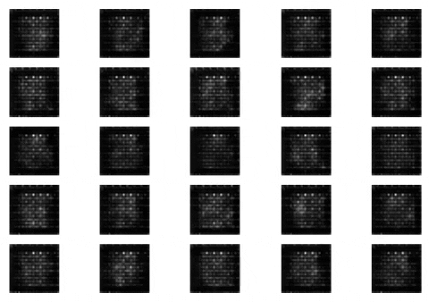

# DCGAN celeba
Code to train DCGAN model with celeba dataset. The code is inspired mainly by https://github.com/YongWookHa/DCGAN-Keras repository.

[celeba](http://mmlab.ie.cuhk.edu.hk/projects/CelebA.html) - Large scale celebrity faces dataset. Aligned and cropped [version](https://drive.google.com/drive/folders/0B7EVK8r0v71pTUZsaXdaSnZBZzg) was used.

This repository contains code as python files as well as a jupyter notebook [DCGAN_celeba.ipynb](DCGAN_celeba.ipynb) that contains the same code, which can be ran on colab.

## Installation
Prerequisite: python 3.7

`pip install -r requirements.txt`

## Usage

### cropface.py
Python command line tool to crop faces in the image and save the images with desired dimensions.

Detects faces using opencv's [haarcascade](https://github.com/opencv/opencv/blob/master/data/haarcascades/haarcascade_frontalface_default.xml).

From over 220k images in celeba dataset, the code produces ca 180k cropped face images.

`python cropface.py`

### dataloader.py
Provides DataLoader class to be used during DCGAN training. The class provides random batch of training images to the model. It can be configured to load all images to the memory which will speed up the training significantly.

### train.py
Contains DCGAN model and the training code. When trained on the GPU enabled colab environment, one epoch trained within 6 minutes with 185k training images.

The training produces the following in the defined backup directory:
- model - json model
- samples - sample images that generator model creates
- log - tensorboard files

`python train.py`

## Results
Samples from generated images trained with MNIST dataset

Samples from generated images trained with celeba dataset
